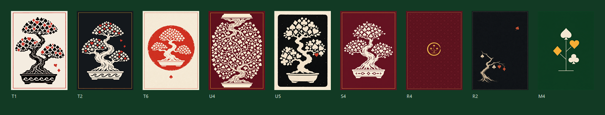
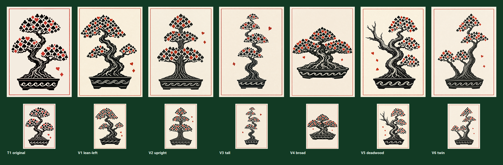

# Kaizen Poker — Logo & Card Back

> **Shipped:** `T1-linocut-back-washi` is the production card back as of
> 2026-07-30. Source lives at `card_back/kaizen-bonsai-linocut.png`; the app
> loads the derived `web_art/card_back/kaizen-bonsai-linocut.webp` (44 kB).
> Chosen over the six `V*` form variants below — see
> [Iterating on the tree form](#iterating-on-the-tree-form).
>
> Two things were needed to land it, both recorded here for whoever changes the
> back next:
> - **Aspect.** The art is 2:3 (0.667); the card slot is 68×95 (0.716) and
>   `CardBack` uses `objectFit: cover`, which would have cropped ~3.5% off the
>   top and bottom and clipped the vermilion hairline frame. The source is
>   stored pre-fitted to 1099×1536 so nothing is cut.
> - **Container.** `CardBack` styled its rim `2px solid #f4e9d866` over a
>   crimson radial gradient — correct for the crimson placeholder SVG, but over
>   cream paper the translucent rim muddied to mauve. `components.jsx` now
>   branches: paper ground + thin ink edge when printed art is present, the
>   original crimson treatment when it falls back to the SVG.

Thirty-six concepts, four design languages, one recommendation.

All art in `concepts/` was generated via Codex's image tool from prompts written
for this project.

> **Note:** `brand/concepts/` is gitignored (~60 MB of trial renders), so the
> individual concept images below only resolve on the machine that generated
> them. The two composite comparison sheets — `thumbnail-test.png` and
> `iteration-T1-variants.png` — are tracked and carry the substance of the
> argument on their own.

---

## The idea underneath all of it

**A bonsai is a deck you keep pruning.** You cut it back so what remains grows
better. That's kaizen, that's deckbuilding, and it's the same gesture — which
is why the bonsai motif you'd already landed on is the right one. Every concept
below is built on one move:

> **The leaves are the suits.**

Not "a tree with some card symbols nearby" — the foliage *is* spades, hearts,
diamonds and clubs, so the tree can't be read without reading the deck. A few
leaves have fallen: the cards you pruned.

---

## The recommendation

### Primary lockup

`concepts/T3-linocut-lockup.png`

A three-color linocut mark over a letterspaced serif. The suits are the leaves,
red suits printed in vermilion so the canopy reads as foliage from across the
room and as a deck up close. The type is deliberately small and quiet — the
mark carries the weight, which is what lets the same lockup work on a box, a
title screen, and a business card.

**Horizontal alternate** for wide spaces (nav bars, headers, og:image):

`concepts/U6-lockup-seal.png`

### Card back — light and dark

| Light (`T1`) | Dark (`T2`) |
|---|---|
|  |  |

`concepts/T1-linocut-back-washi.png` · `concepts/T2-linocut-back-night.png`

Same tree, same three inks, inverted. **T2 is the one for the app** — the board
is dark green felt and the cream-on-charcoal back sits on it without fighting.
T1 is the print/physical-deck version. Two red suit leaves drift free of the
canopy on both.

### App icon / favicon

| `S6` square seal | `T5` crimson & gold | `T4` bold silhouette |
|---|---|---|
|  |  |  |

`S6` is my pick — the chop-mark square is distinctive in a tab strip, the single
red heart gives it one memorable spot of color, and reversed-out white on black
survives being shrunk to 16px better than any line-based mark here. `T5` is the
same idea in your existing crimson/gold palette if you'd rather the icon match
the current theme than lead it.

---

## The thumbnail test

A logo gets looked at. A card back gets looked at *four hundred times a game, at
68×95 pixels.* So I rendered the finalists at actual in-game size:

This killed two concepts I liked at full size:

- **R4** (the gold lattice) — the emblem shrinks to an illegible speck and the
  whisper-quiet suit lattice flattens into plain maroon. Elegant at poster size,
  dead at card size.
- **R2** (the sumi-e) — 70% empty paper reads as *blank* at 68px. Beautiful as a
  print, invisible as a card back.

And it confirmed the winners: **T1, T2, U4, U5, S4** all hold their silhouette.
The lesson is that a card back needs a big, high-contrast, edge-to-edge shape —
restraint has to come from the *color count*, not from empty space.

---

## The four families

### 1. Suit-Leaf Stamp — *recommended*

Solid single- or three-color linocut. Descended from the `solid_stamp_square`
reference you already liked, pushed toward cleaner cutting and a disciplined
palette.

| | | |
|---|---|---|
|  |  |  |
| `S1` refined mono — your reference, recut so *every* leaf is a suit | `S3` two-tone — where the family clicked | `U3` the pot is a stack of poker chips |
|  |  |  |
| `U1` two-block print, sun disc behind | `U2` windswept — the pruned leaves stream off | `S2` hinomaru seal, reversed out |

`U2` is the sleeper. A *fukinagashi* bonsai with its leaves tearing loose and
trailing off the composition is the most literal picture of deckbuilding in the
whole set, and the asymmetry gives you somewhere to put type.

`U1` is the most striking single image here. It's also the least flexible — that
sun disc wants to be a poster, not a favicon.

**Card backs in this family:**

| | | |
|---|---|---|
|  |  |  |
| `U5` stamped ink panel | `U4` true 180° rotational symmetry | `T6` seal on paper |
|  |  | |
| `S4` cream on crimson | `S5` mirrored, canopies stacked | |

`U4` deserves a note: it's genuinely rotationally symmetric, which is the one
functional requirement a real card back has (an opponent must not be able to
read orientation). It's also the densest thing here and reads as a *textile* at
thumbnail size — gorgeous, but it loses the tree. `S5` attempts the same trick
and reads as a totem pole; I'd skip it.

### 2. Ink & Ensō — most elegant, least legible

One continuous brushstroke that starts as an ensō and becomes the trunk.

| | |
|---|---|
|  |  |
| `R6` light lockup | `R7` dark lockup |
|  |  |
| `R5` the mark, cream | `M5` the mark, gold on charcoal |

This was my favorite until the thumbnail test. The one-stroke conceit — the
circle *becomes* the tree — is the cleverest drawing in the set, and `R6` is a
genuinely beautiful lockup. But the family only carries three suit leaves (a
brushstroke can't hold fifty-two), so it says "zen" much louder than it says
"cards," and its card backs (`R8`, `R9`, `M1`, `R2`) all go faint at 68px.

**Worth keeping anyway:** if you ever want a quiet, premium, non-game context —
a rulebook cover, a title card, a print — `R6` is the asset.

### 3. Swiss Geometric — the system play

A bonsai reduced to four lines and four suit shapes.

| | |
|---|---|
|  |  |
| `R11` lockup | `R3` card back |

Rigorous and modern, and the only family whose mark is trivially rebuildable as
hand-authored SVG — meaning it could live in `components.jsx` as real vector at
any size, no PNG pipeline, no raster edges. If you ever want the logo to
*animate* (pads dropping in, suits swapping), this is the one that can.

It's also the coldest. It reads "design consultancy" more than "card game."

### 4. Ornate Casino — the maximalist path not taken

| | | |
|---|---|---|
|  |  |  |

Where I started, before you said elegant. Including them because `C1` is worth a
second look — it's the only concept that matches the *existing card art*
(saturated, painterly, glowing), so if the goal were "the card back should feel
like the cards," this is that answer. It's just a different game's brand than
the one the other 27 concepts are proposing.

`L3` is the chunky Balatro-style title treatment, which is what your current
`theme.css` is actually built for:

---

## The honest tension

Your app today is **"Balatro Juice"** — chunky Lilita One, hard drop shadows,
saturated felt, painterly cards. Everything I'm recommending is **quiet,
printed, and restrained.** They are not the same brand.

Two coherent ways out, and it's a real choice:

**A. Let the brand lead.** Adopt the linocut family, and over time pull the UI
toward it — thinner type, less shadow, three inks. You end up with something
that looks like a designed object rather than a game jam entry. The card art
stays painterly; the *chrome* goes quiet. This is what I'd do.

**B. Let the app lead.** Take `T5` (crimson/gold seal) as the icon and `L3` as
the wordmark, and keep the juice. Cheaper, zero UI churn, and the seal still
gives you a real mark instead of the placeholder SVG.

What doesn't work is `T3` sitting above a Lilita One button.

---

## Production notes

Per `CLAUDE.md`, **do not** drop these into `web_art/` — the optimizer deletes
anything it didn't generate. The path in is:

1. Card back → save the chosen PNG into `card_back/`. `CardBack` in
   `KaizenPoker.jsx` auto-detects an image there and falls back to the
   placeholder SVG when the folder is empty.
2. Run `npm run optimize-art` (or just `npm run dev` — the `predev` hook covers
   it).
3. Favicon → `public/favicon.svg` is currently a hand-built SVG chip. An icon
   from this set would need to be exported as PNG and the `<link>` in
   `index.html` updated, or redrawn as SVG (trivial for the geometric family,
   not for the linocut ones).
4. Verify with `npm run smoke` and look at `smoke_output/`.

Two caveats worth knowing before you commit:

- These are **1024×1536 rasters**, not vectors. Fine for a card back at 68×95
  and for a 512px icon; not fine for a printed box at 300dpi. If a physical deck
  is on the table, the chosen mark should get redrawn as real vector art.
- The lockups have **baked-in type**. Live text would be sharper and
  translatable — the mark and the wordmark should be separated before either
  lockup does real work.

---

## Iterating on the tree form

Six variants of T1 holding the concept, palette and frame fixed and perturbing
only the tree's form. Full-size over in-game size:

| | Verdict |
|---|---|
| `V1` lean-left | Boldest silhouette of the set, but the canopy drifted toward flat triangular slabs and lost T1's hand-cut pad feathering |
| `V2` upright | Symmetric and heraldic — the worst bonsai and the best potential *crest* |
| `V3` tall | Too much bare paper; thin at card size with a dead lower-left quadrant |
| `V4` broad | Strong low canopy and root flare; the closest runner-up |
| `V5` deadwood | Conceptually sharpest — the pruned spar *is* the game — but at 68px the bare jin reads as a printing defect |
| `V6` twin | Two crowns separate into two weak trees when small |

**T1 won on balance.** The variants each traded something away: V1 lost the
cutting quality, V2 lost the bonsai, V4 traded asymmetry for mass. Worth knowing
that T1's three pads *do* merge into one indistinct blob at 68px more than V4's
do — it's the one thing V4 genuinely did better, and the reason to revisit this
if the back ever needs to read smaller than it does now.

---

## Everything, in one place

Full-size files are in `concepts/`. Naming: `A`/`B`/`C` ornate, `L` first-pass
logos, `M`/`R` minimalist and ink, `S`/`T`/`U` stamp family.
